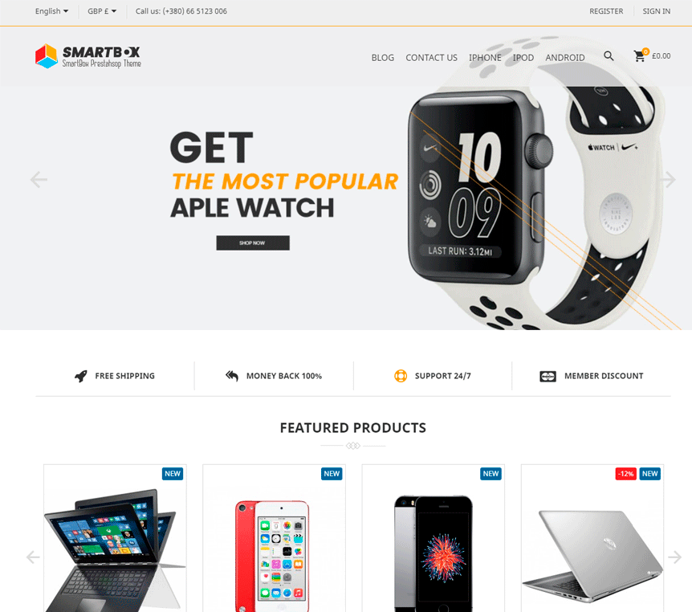
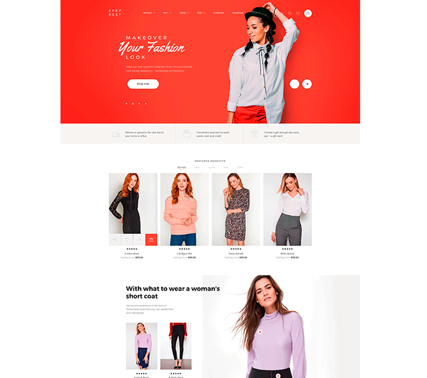

# Collection of prestashop themes 1.7.7

# PrestaShop Themes Collection

Recopilatorio de **temas para PrestaShop 1.7.7** con sus módulos asociados. Este repositorio incluye dos temas profesionales completos: **SmartBox** de MyPrestaModules y **Nextprest** de TemplateMonster, listos para instalar y personalizar en tiendas PrestaShop.

[](https://www.prestashop.com/)
[](https://www.php.net/)
[](https://www.smarty.net/)
[](https://sass-lang.com/)

---

## Tabla de Contenidos

- [Sobre el Proyecto](#sobre-el-proyecto)
- [Temas Incluidos](#temas-incluidos)
  - [SmartBox — MyPrestaModules](#smartbox--myprestamodules)
  - [Nextprest (PROD-14516) — TemplateMonster](#nextprest-prod-14516--templatemonster)
- [Estructura de un Tema PrestaShop](#estructura-de-un-tema-prestashop)
- [Requisitos](#requisitos)
- [Instalación](#instalación)
- [Personalización](#personalización)
- [Tecnologías](#tecnologías)
- [Recursos](#recursos)
- [Autor](#autor)

---

## Sobre el Proyecto

Los temas de PrestaShop definen la apariencia visual completa de la tienda: layout, estilos, templates y comportamiento del front-office. A diferencia de los módulos, un tema controla toda la experiencia del usuario final, desde la homepage hasta el proceso de checkout.

Este repositorio contiene dos temas comerciales profesionales con sus módulos necesarios, pensados como referencia para el desarrollo y la personalización de tiendas PrestaShop 1.7.

---

## Temas Incluidos

### SmartBox — MyPrestaModules

| | |
|---|---|
| **Carpeta** | `smartbox/` |
| **Proveedor** | MyPrestaModules |
| **Versión PS** | 1.7.7 |
| **Tipo** | Tema multipropósito para e-commerce |



**Características principales:**

- Diseño responsive y moderno optimizado para móvil y desktop
- Sistema de módulos MPM integrados (header, footer, slider, bloques personalizados)
- Configurador de tema visual desde el Back Office
- Soporte multiidioma y multitienda
- Templates Smarty personalizados para todas las páginas de la tienda
- Estilos SCSS compilables para facilitar la personalización

**Módulos incluidos:** El tema SmartBox funciona en conjunto con los módulos de la serie `mpm_*` (MyPrestaModules). Consulta el repositorio [prestashop-modules](https://github.com/david-berruezo/prestashop-modules) para ver el catálogo completo de módulos compatibles.

---

### Nextprest (PROD-14516) — TemplateMonster

| | |
|---|---|
| **Carpeta** | `PROD-14516/` |
| **Proveedor** | TemplateMonster |
| **Versión PS** | 1.7.7 |
| **Tipo** | Tema premium multipropósito |



**Características principales:**

- Tema premium de TemplateMonster con diseño profesional
- Mega menú avanzado y mega layout configurable
- Blog integrado con sistema de comentarios y posts relacionados
- Lookbook / catálogo visual de productos
- Comparador de productos y lista de deseos
- Búsqueda avanzada con autocompletado
- Páginas AMP (Accelerated Mobile Pages) para rendimiento móvil
- Oferta del día con countdown timer
- Zoom de producto y galería de imágenes en listados
- Integración con Google Maps

**Módulos incluidos:** El tema Nextprest funciona con los módulos de la serie `jx*` (Template Monster). Consulta el repositorio [prestashop-modules](https://github.com/david-berruezo/prestashop-modules) para ver el catálogo completo.

---

## Estructura de un Tema PrestaShop

Los temas de PrestaShop 1.7 siguen una estructura estándar definida por el framework:

```
nombre_tema/
├── config/
│   └── theme.yml                # Configuración del tema (nombre, versión, hooks, módulos)
├── assets/
│   ├── css/                     # Estilos CSS compilados
│   ├── js/                      # Scripts JavaScript
│   └── img/                     # Imágenes del tema
├── _dev/
│   ├── css/                     # Fuentes SCSS
│   └── js/                      # Fuentes JavaScript (ES6)
├── templates/
│   ├── catalog/                 # Páginas de catálogo (listado, ficha de producto)
│   ├── checkout/                # Proceso de compra y carrito
│   ├── cms/                     # Páginas CMS
│   ├── customer/                # Área de cliente (cuenta, pedidos, direcciones)
│   ├── errors/                  # Páginas de error (404, mantenimiento)
│   ├── layouts/                 # Layouts base (layout-full-width, layout-both-columns)
│   ├── _partials/               # Parciales reutilizables (header, footer, breadcrumb)
│   └── index.tpl                # Template principal
├── modules/                     # Override de templates de módulos
├── preview.png                  # Captura de pantalla del tema
└── dependencies/                # Módulos requeridos por el tema
```

El archivo clave es `config/theme.yml`, que define qué hooks utiliza el tema, qué módulos necesita y la configuración de layouts disponibles.

---

## Requisitos

- **PrestaShop** 1.7.7.x
- **PHP** >= 7.1
- **MySQL** >= 5.6 o MariaDB >= 10.1
- **Node.js** y npm (solo si se necesita compilar assets SCSS/JS)
- Módulos asociados al tema instalados previamente

---

## Instalación

### Paso 1: Instalar los Módulos del Tema

Cada tema requiere sus módulos asociados. Es imprescindible instalarlos **antes** de activar el tema.

```bash
# Clonar el repositorio de módulos
git clone https://github.com/david-berruezo/prestashop-modules.git

# Copiar los módulos necesarios al directorio de PrestaShop
# Para SmartBox → módulos mpm_*
# Para Nextprest → módulos jx*
cp -r prestashop-modules/mpm_* /var/www/html/prestashop/modules/
```

Activar cada módulo desde **Back Office > Módulos > Gestor de módulos**.

### Paso 2: Instalar el Tema

**Método A — Desde el Back Office:**

1. Comprimir la carpeta del tema en un archivo `.zip`
2. Ir a **Diseño > Tema y Logotipo**
3. Clic en **Añadir nuevo tema** > **Importar desde el ordenador**
4. Seleccionar el `.zip` y confirmar

**Método B — Instalación Manual (FTP/SSH):**

```bash
# Clonar el repositorio
git clone https://github.com/david-berruezo/prestashop-themes.git

# Copiar el tema al directorio de temas de PrestaShop
cp -r prestashop-themes/smartbox /var/www/html/prestashop/themes/

# Establecer permisos
chmod -R 755 /var/www/html/prestashop/themes/smartbox
chown -R www-data:www-data /var/www/html/prestashop/themes/smartbox
```

### Paso 3: Activar el Tema

1. Ir a **Diseño > Tema y Logotipo** en el Back Office
2. Seleccionar el tema instalado
3. Clic en **Usar este tema**
4. Limpiar la caché desde **Parámetros avanzados > Rendimiento**

---

## Personalización

### Compilar Assets (SCSS/JS)

Si necesitas modificar estilos o scripts, los temas incluyen fuentes SCSS en la carpeta `_dev/`:

```bash
# Entrar en la carpeta _dev del tema
cd /var/www/html/prestashop/themes/smartbox/_dev

# Instalar dependencias
npm install

# Compilar assets en modo desarrollo (con watch)
npm run watch

# Compilar assets para producción
npm run build
```

### Modificar Templates

Los templates Smarty (`.tpl`) se encuentran en la carpeta `templates/` del tema. Para personalizar la apariencia de una página específica sin modificar el tema original, se recomienda usar un **tema hijo (child theme)**.

### Override de Módulos

Para personalizar la apariencia de un módulo específico dentro del tema, copiar el template del módulo a la carpeta `modules/` del tema:

```bash
# Ejemplo: personalizar el template del módulo mpm_homeslider
cp /var/www/html/prestashop/modules/mpm_homeslider/views/templates/hook/slider.tpl \
   /var/www/html/prestashop/themes/smartbox/modules/mpm_homeslider/views/templates/hook/slider.tpl
```

PrestaShop cargará automáticamente el template del tema en lugar del template original del módulo.

---

## Tecnologías

| Tecnología | Uso | Porcentaje |
|---|---|---|
| **PHP** | Lógica del tema y módulos | 49.9% |
| **Smarty** | Motor de plantillas (templates `.tpl`) | 27.6% |
| **JavaScript** | Interactividad del front-end | 7.7% |
| **SCSS** | Preprocesador de estilos CSS | 7.6% |
| **CSS** | Estilos compilados | 6.5% |
| **HTML** | Estructura base | 0.7% |

---

## Recursos

### Documentación Oficial

- [PrestaShop Theme Developer Guide](https://devdocs.prestashop-project.org/8/themes/)
- [Crear un Tema PrestaShop](https://devdocs.prestashop-project.org/8/themes/getting-started/)
- [Estructura del tema (theme.yml)](https://devdocs.prestashop-project.org/8/themes/getting-started/theme-yml/)
- [Templates y Layouts](https://devdocs.prestashop-project.org/8/themes/templates/)
- [Child Themes](https://devdocs.prestashop-project.org/8/themes/getting-started/child-themes/)
- [Assets Management (Webpack)](https://devdocs.prestashop-project.org/8/themes/getting-started/asset-management/)

### Proveedores de Temas

- [TemplateMonster PrestaShop Themes](https://www.templatemonster.com/prestashop-themes.php)
- [MyPrestaModules](https://mypresta.eu/)
- [PrestaShop Addons — Temas](https://addons.prestashop.com/es/3-plantillas-prestashop)

### Repositorio Relacionado

- [prestashop-modules](https://github.com/david-berruezo/prestashop-modules) — Colección de módulos PrestaShop compatibles con estos temas

---

## Autor

**David Berruezo** — Software Engineer | Fullstack Developer

- GitHub: [@david-berruezo](https://github.com/david-berruezo)
- Website: [davidberruezo.com](https://www.davidberruezo.com)
